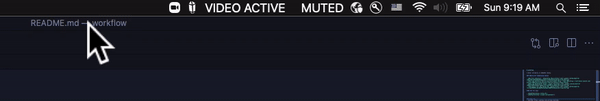

# workflow 

This is a collection of snippets, settings and resources related to setting up a dev env or "workflow". 


> Note: This doc is currently in *draft* status.

### Apps

- iTerm2 (use Self Service app)
- [VSCode](https://code.visualstudio.com/) 
- [Sublime Text 4](https://www.sublimetext.com/) 

### Command Line or Brew Install Utils

- [Oh My ZSH](https://github.com/ohmyzsh/ohmyzsh)
- [Homebrew](https://brew.sh/), MacOS package manager
- [Amethyst](https://ianyh.com/amethyst/), automagical window tiler, watch this [30s example](https://www.youtube.com/watch?v=boPilhScpkY)
- [autojump](https://github.com/wting/autojump), easily jump to visited directories
- [n](https://github.com/tj/n), if you already have `node`
- [n-install](https://github.com/mklement0/n-install), if you do not have `node`
- [rbenv](https://github.com/rbenv/rbenv), version manager based on shims for ruby
- [pyenv](https://github.com/pyenv/pyenv), version manager based on rbenv for python
- [neofetch](https://github.com/dylanaraps/neofetch/wiki/Installation), display system info

```
brew install --cask amethyst
brew install autojump
brew install neofetch
brew install rbenv
brew install pyenv
```

> Amethyst Preferences, Mouse: Uncheck mouse follows focus. Floating: Automatically float App: iTerm2
> Amethyst Preferences, Layouts: Remove all but "Tall" and "Fullscreen"

### VSCode `code` utility

To make editing files easier, first:
- Open VSCode
- Hit `CMD + SHIFT + P` to open the command palette
- Type `shell` or copy this command:
```
Shell Command : Install code in PATH
```

### Oh My ZSH and related config

Hit enter and you can now open VSCode from terminal locations with `code` (you may need to restart your session).

Open the file `.zshrc` 
```
cd ~
code .
```
Change the theme
```
ZSH_THEME="agnoster"
```

#### ZSH Plugins
```
plugins=(git
 autojump
 zsh-autosuggestions
 zsh-syntax-highlighting)
```
Install 
```
git clone https://github.com/zsh-users/zsh-autosuggestions ${ZSH_CUSTOM:-~/.oh-my-zsh/custom}/plugins/zsh-autosuggestions

git clone https://github.com/zsh-users/zsh-syntax-highlighting.git ${ZSH_CUSTOM:-~/.oh-my-zsh/custom}/plugins/zsh-syntax-highlighting
```

Add required entries for shim-based version management, rbenv and pyenv
```
eval "$(rbenv init -)"
eval "$(pyenv init -)"
```

Update the prompt with a little bit of fun:
```
prompt_context() {****
  if [[ "$USER" != "$DEFAULT_USER" || -n "$SSH_CLIENT" ]]; then
    prompt_segment green black "%(!.%.) ༼つ◕_◕༽つ"
  fi
}
```

Install  `agnoster` theme's glyphs via [Powerline Fonts](https://github.com/powerline/fonts), run the following steps:
```
# clone
git clone https://github.com/powerline/fonts.git --depth=1
# install
cd fonts
./install.sh
# clean-up a bit
cd ..
rm -rf fonts
```

Useful: [zsh GitHub commands Cheatsheet](https://github.com/ohmyzsh/ohmyzsh/wiki/Cheatsheet)


### iTerm 2

Manual instructions for setting up iTerm, so that it "Drops down" from a hotkey. In iTerm Preferences:

- General
	- Closing: Quit when all windows are closed
	- Closing: Uncheck confirm quit
	- Selection: Check double-click performs smart select
	- Window: Uncheck adjust window when changing font size
	- (Return here when Hotkey Key is set up)
- Appearance
	- Theme: Minimal
	- Window: Uncheck show window number in title bar
	- Window: Check Hide Scrollbars
- Profiles
    - General: Title Dropdown: select only "PWD", clear other selections
    - General: Working Directory: select "Reuse previous session's directory"
	- Colors: Color Preset: Solarized Dark
	- Text: Font: Fira Mono for Powerline
	- Text: Font size: 21
	- **Window: Style: Full-Width Top of Screen**
	- **Window: Space: All Spaces**
	- **Keys: Hotkey Window: check "A hotkey opens..."**
		- Hotkey
		- Double-tap key: Command (?)
		- On Dock icon click: Show this hotkey window
	- After Hotkey setup, head back to General tab and:
        - Startup: select in "Window restoration policy" dropdown, "Only Restore Hotkey Window"
	    - (Note: there's now a Hotkey section in the main "Keys", so it is possible to do this outside of Profiles)
	- Session: At the bottom, check "Status bar enabled", configure and select "Auto-Rainbow: Automatic"
- Keys 
    - Select menu item: Restart Session Hotkey: `shift + ⌘ + r`
- Advanced
    - Session: Suppress restart confirmation alert: Yes
    - Tabs: Custom tab label size: 16
    - Tabs: Preferred tab width when tabs are equally sized: 280
    - Tabs: Use custom font size for tab labels?

Silence "Last Login" message for new tab. `cd ~`, then: 
```
touch .hushlogin
```

### Zoom "Live Mic" Menu Bar

A slightly silly utility to keep track of a live mic in meetings.



- SwiftBar https://github.com/swiftbar/SwiftBar
	- `brew install swiftbar`
	- Cmd + space, run `swiftbar`
	- Choose a plugins folder, like `Documents/Swiftbar`
	- Download the Zoom status scripts: https://github.com/nickjvturner/SwiftBar-Zoom-Plugins
	- Place the downloaded plugins into the freshly selected plugins folder
	- Allow Accessibility permissions, and once permissions are correctly configured, launch Zoom, start a meeting and test the information output to your menubar.

> Note: the implementation of this could be better, but it works for now. The script isn't perfectly responsive and may have some overhead. 

### VSCode Semantic Highlighting

VSCode has a feature called [Semantic Highlighting](https://code.visualstudio.com/api/language-extensions/semantic-highlight-guide). This is in contrast to and in addition to "Synatax Highlighting" that we are all used to. I highly recommened reading about how using color for syntax is a "waste" of an information channel at [Syntax highlighting is a waste of an information channel](https://buttondown.email/hillelwayne/archive/syntax-highlighting-is-a-waste-of-an-information/). 

Therefore, I highly recommend enabling Semantic Highlighting by setting it to `true` in VSCode and using this theme, specifically created to take advantage of this feature: [Mayukai Semantc Mirage](https://marketplace.visualstudio.com/items?itemName=GulajavaMinistudio.mayukaithemevsc)

### App Store

- Things 3
- iA Writer


### If Sublime Text 4

Create a symlink for opening Sublime:
```
ln -s "/Applications/Sublime Text.app/Contents/SharedSupport/bin/subl" /usr/local/bin/sublime
```
[Source](https://olivierlacan.com/posts/launch-sublime-text-3-from-the-command-line/)


### Hardware

- Keyboard: [ZSA Moonlander](https://www.zsa.io/moonlander/)
    - A powerful and easily programmable split ergo, quickly becoming my favourite keyboard
    - [Link to my configuration](https://configure.zsa.io/moonlander/layouts/eW95r/latest/0)
- Mouse: [Glorious Model O](https://www.pcgamingrace.com/products/glorious-model-o-white), wonderful, super light weight, comfortable, with a cord that never catches
- Microphone: Shure [SM7B](https://www.shure.com/en-US/products/microphones/sm7b), best in the game, make sure you have a USB Audio Interface and a definitely pick up a preamp
- Audio Interface: [Scarlett Solo](https://focusrite.com/en/usb-audio-interface/scarlett/scarlett-solo)
- Preamp: [Cloudlifter](https://www.sweetwater.com/store/detail/CL1Cloud--cloud-microphones-cl-1-cloudlifter-1-channel-mic-activator)
- Green Screen: [Elgato Chroma Key](https://www.elgato.com/en/green-screen)
- Lights: [Neewer Ring Light](https://www.amazon.com/Neewer-Ring-Light-Kit-Self-Portrait/dp/B01LXDNNBW), and [Neewer 2 Pack Dimmable LEDs](https://www.amazon.com/Neewer-Packs-Dimmable-Bi-Color-Lighting/dp/B072Q42GXQ/ref=sr_1_9?dchild=1&keywords=neewer&qid=1621782731&s=electronics&sr=1-9)


#### Keyboard Notes / Todo:

- Consider swapping the space bar and L1 on the piano keys? The space bar is often a "tap", and L1 is a hold, slightly awkward, but space is used more often... Tough call.
- Dedicated copy & paste
- Consider unbinding pinky key enter and L1, to force thumb key usage.
- Add a Zoom unmute key of some sort. 
- Consider better `[]()` 
- Add right hand arrow keys, as they would allow better modifier combinations, possibly `IJKL`, plus and parens are the only things to move
- unbind left hand MO1.

> Possibly add changelog here. No more left shift is really a tough one to get used to!

### Favorite Splunk Value:

Disruptive

> We strive to lead, not follow, while continuing to disrupt the market.  We never say "Don't change it if it's not broken." We're always looking at things from different angles with an eye for how we can do it better, faster and more efficiently.

A friend told me my motto should be: "If it's not broken, fix it 'til it is".
